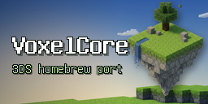

#  VoxelCore — Nintendo 3DS port

[](https://github.com/niazlv/voxelcore-3ds/actions/workflows/build-3ds.yml)
[](https://github.com/niazlv/voxelcore-3ds/releases/latest)

A port of [VoxelCore](https://github.com/MihailRis/voxelcore) — an open-source
voxel engine by MihailRis — to the **original Nintendo 3DS**: ARM11 @ 268 MHz,
128 MB RAM, PICA200 GPU, no OpenGL, no OpenAL, and a screen the size of a
matchbox.

This was made **just for fun**, to find out whether a modern desktop voxel
engine can run on a 2011 handheld at all. It can.



## Downloads

- [`voxelcore3ds.3dsx`](https://github.com/niazlv/voxelcore-3ds/releases/latest) —
  run via Homebrew Launcher, or open directly in the
  [Azahar](https://azahar-emu.org/) emulator.
- Every push also produces a fresh `voxelcore3ds` artifact in
  [Actions](https://github.com/niazlv/voxelcore-3ds/actions/workflows/build-3ds.yml).
- A CIA can be packaged with `3ds/cia/build_cia.sh` (requires makerom).

## What works / what doesn't

| Feature | Status |
|---|---|
| World generation, loading, saving (SD card) | ✅ works |
| Survival and creative modes | ✅ works |
| Block placing / breaking, vertex lighting | ✅ works |
| Engine GUI on the touch screen (inventory, hotbar, tabs) | ✅ works |
| Tap-to-select hotbar, touch menu | ✅ works |
| Entity models (drops, falling blocks, mobs) | ✅ works |
| Item throwing (SELECT) | ✅ works |
| Audio: NDSP backend, ogg via stb_vorbis | ✅ works |
| Content packs from SD | ✅ works |
| Lua scripting (LuaJIT interpreter, no-FFI fallbacks) | ✅ works |
| Fog, dense-pass leaves alpha, underwater tint, backlight | ✅ works |
| In-game chat rendering | ⚠️ broken (blank box on the bottom screen) |
| CIA packaging in CI | ⚠️ manual only (makerom) |
| Particles, 3D text, block wraps, post-effects | ❌ not ported |
| Networking / multiplayer | ❌ not ported |
| Advanced render (shadows, SSAO, clouds) | ❌ out of scope for this GPU |
| Stereoscopic 3D on the top screen | ❌ not yet |
| New 3DS speedup (804 MHz / L2) | ❌ not yet |

Verified in Azahar (stable ~60 FPS UI, playable world at load distance 4).

## How it differs from the desktop engine

The engine core is used **as-is** — the port patches only 26 lines of engine
code (guarded by `VC_PORT_3DS`). Everything else lives under [`3ds/`](3ds/):

- **Renderer**: custom PICA200 renderer written against GPU registers
  (no citro3d, no OpenGL). The engine's whole GUI stack (Batch2D, fonts,
  DrawContext) renders on the bottom screen via `VC_NO_GL`.
- **Audio**: NDSP backend plugged into the engine's
  `VC_AUDIO_CUSTOM_BACKEND` hook instead of OpenAL.
- **Memory profile**: chunk height 128 (instead of 256), lazy chunk pool,
  24 px item icons — via the engine's build-time knobs. That's the
  difference between running and OOM on 128 MB.
- **Scripting**: LuaJIT in interpreter mode (no RWX pages on 3DS), with
  pure-Lua fallbacks for everything that normally needs the FFI.

## 3DS hardware actually used

- **Both screens**: top — 3D world (400×240), bottom — full engine GUI (320×240)
- **Touch screen** for all UI interaction (inventory, hotbar, menus)
- **PICA200** vertex shaders (`3ds/shaders/*.v.pica`), native texture tiling
- **DSP (NDSP)** for audio mixing (needs a dspfirm dump on real hardware)
- **SD card** for worlds, content packs and logs; **RomFS** for engine assets
- **HID**: buttons, D-pad, circle pad
- Maybe someday: stereoscopic 3D, New 3DS clock boost, local wireless

## Building

Docker is the only requirement (devkitPro image is pulled automatically):

```bash
git clone --recurse-submodules https://github.com/niazlv/voxelcore-3ds.git
cd voxelcore-3ds
./3ds/build.sh
```

Output: `3ds/build/voxelcore3ds.3dsx`. LuaJIT is cross-compiled automatically
on first build (see [`3ds/build_luajit.sh`](3ds/build_luajit.sh) for the
exact configuration). Port internals are described in
[`3ds/README.md`](3ds/README.md).

## Relation to upstream

`main` = upstream VoxelCore + a set of platform-independent fixes and
portability mechanisms + the `3ds/` tree. The platform-independent part
(alignment UB in gzip, null-deref fixes, building without OpenGL/OpenAL,
Lua-without-FFI fallbacks, memory-profile build knobs, small-screen UI) was
offered upstream as [MihailRis/voxelcore#889](https://github.com/MihailRis/voxelcore/pull/889);
it was declined — additional platform support is not currently planned there —
so those changes live in this repository (and in the
[`portability`](https://github.com/niazlv/voxelcore/tree/portability) branch
of my fork) instead.

For the engine itself — documentation, content packs, scripting API — see
the [upstream repository](https://github.com/MihailRis/voxelcore) and its
[docs](https://github.com/MihailRis/VoxelCore/blob/release-0.31/doc/en/main-page.md).

## Credits

- [MihailRis](https://github.com/MihailRis) — VoxelCore itself
- devkitPro / libctru — 3DS toolchain
- LuaJIT, EnTT, GLM, stb — bundled third-party libraries

License: same as upstream VoxelCore.
